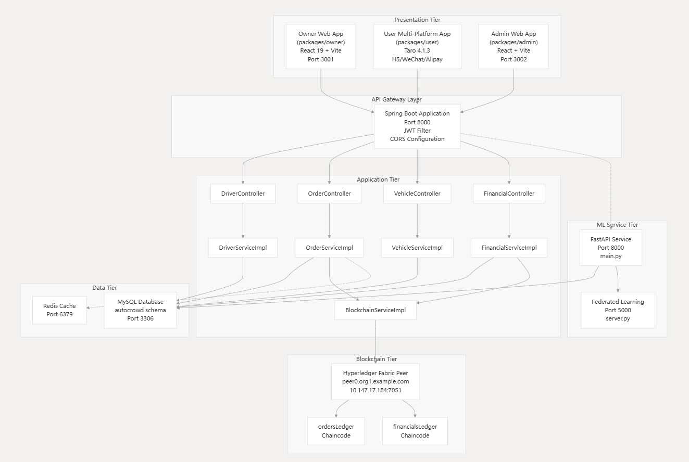

# 🚀 Blockchain_NEV

[![zread](https://img.shields.io/badge/Ask_Zread-_.svg?style=flat&color=00b0aa&labelColor=000000&logo=data%3Aimage%2Fsvg%2Bxml%3Bbase64%2CPHN2ZyB3aWR0aD0iMTYiIGhlaWdodD0iMTYiIHZpZXdCb3g9IjAgMCAxNiAxNiIgZmlsbD0ibm9uZSIgeG1sbnM9Imh0dHA6Ly93d3cudzMub3JnLzIwMDAvc3ZnIj4KPHBhdGggZD0iTTQuOTYxNTYgMS42MDAxSDIuMjQxNTZDMS44ODgxIDEuNjAwMSAxLjYwMTU2IDEuODg2NjQgMS42MDE1NiAyLjI0MDFWNC45NjAxQzEuNjAxNTYgNS4zMTM1NiAxLjg4ODEgNS42MDAxIDIuMjQxNTYgNS42MDAxSDQuOTYxNTZDNS4zMTUwMiA1LjYwMDEgNS42MDE1NiA1LjMxMzU2IDUuNjAxNTYgNC45NjAxVjIuMjQwMUM1LjYwMTU2IDEuODg2NjQgNS4zMTUwMiAxLjYwMDEgNC45NjE1NiAxLjYwMDFaIiBmaWxsPSIjZmZmIi8%2BCjxwYXRoIGQ9Ik00Ljk2MTU2IDEwLjM5OTlIMi4yNDE1NkMxLjg4ODEgMTAuMzk5OSAxLjYwMTU2IDEwLjY4NjQgMS42MDE1NiAxMS4wMzk5VjEzLjc1OTlDMS42MDE1NiAxNC4xMTM0IDEuODg4MSAxNC4zOTk5IDIuMjQxNTYgMTQuMzk5OUg0Ljk2MTU2QzUuMzE1MDIgMTQuMzk5OSA1LjYwMTU2IDE0LjExMzQgNS42MDE1NiAxMy43NTk5VjExLjAzOTlDNS42MDE1NiAxMC42ODY0IDUuMzE1MDIgMTAuMzk5OSA0Ljk2MTU2IDEwLjM5OTlaIiBmaWxsPSIjZmZmIi8%2BCjxwYXRoIGQ9Ik0xMy43NTg0IDEuNjAwMUgxMS4wMzg0QzEwLjY4NSAxLjYwMDEgMTAuMzk4NCAxLjg4NjY0IDEwLjM5ODQgMi4yNDAxVjQuOTYwMUMxMC4zOTg0IDUuMzEzNTYgMTAuNjg1IDUuNjAwMSAxMS4wMzg0IDUuNjAwMUgxMy43NTg0QzE0LjExMTkgNS42MDAxIDE0LjM5ODQgNS4zMTM1NiAxNC4zOTg0IDQuOTYwMVYyLjI0MDFDMTQuMzk4NCAxLjg4NjY0IDE0LjExMTkgMS42MDAxIDEzLjc1ODQgMS42MDAxWiIgZmlsbD0iI2ZmZiIvPgo8cGF0aCBkPSJNNCAxMkwxMiA0TDQgMTJaIiBmaWxsPSIjZmZmIi8%2BCjxwYXRoIGQ9Ik00IDEyTDEyIDQiIHN0cm9rZT0iI2ZmZiIgc3Ryb2tlLXdpZHRoPSIxLjUiIHN0cm9rZS1saW5lY2FwPSJyb3VuZCIvPgo8L3N2Zz4K&logoColor=ffffff)](https://zread.ai/SoftGhostGU/Blockchain_NEV) [](https://deepwiki.com/SoftGhostGU/Blockchain_NEV)

📖 Chinese Version: [Chinese README](README.md)

### Overview

🚏 Blockchain_NEV is a comprehensive decentralized ride-hailing platform that integrates **blockchain technology**, **federated learning**, and **multi-platform frontend applications**. It aims to build a safe, smart, and user-friendly transportation ecosystem. This project showcases the fusion of modern networking technology and distributed ledger technology, with the goal of establishing trust and transparency in shared mobility services.   

✨ The project uses pnpm workspaces for monorepo management, enabling efficient dependency handling and consistent build processes for all frontend applications [pnpm-workspace.yaml#L1].


### Project Construction

🎉 The platform adopts **a microservices architecture**, achieving clear separation of responsibilities across different tiers:




#### Frontend Applications

The platform offers **three different frontend applications**, tailored for different user roles:

| Application   | Technology Stack            | Target Platform | Core Functions               |
|---------------|---------------------------|-----------------|------------------------------|
| 🔁 Management Console | Vue.js + Naive UI       | Web             | Administrative Management, System Monitoring |
| 🚗 Owner Portal   | React + Ant Design        | Web             | Fleet Management, Revenue Analysis |
| 📱 User Mobile App | Taro + React            | H5/WeChat/Alipay | Ride Service, Real-time Tracking |

All applications share **common API tools** and **map services** through a centralized `api/` package, ensuring consistent data processing and integrating **Amap (Gaode Map)** services for location functionality [packages/owner/package.json#L31].


#### Backend Services

🧠 **Spring Boot Backend** serves as the central API gateway, providing comprehensive functionality:

- **RESTful API Controllers** handle HTTP requests and business logic
- **JPA Database Integration** uses MySQL for persistent data storage
- **Security Layer** implements JWT authentication and Spring Security
- **Redis Cache** is used for performance optimization and session management
- **Hyperledger Fabric Gateway** integration for blockchain interaction

Backend configuration uses **Java 17**, including dependencies for blockchain integration, validation, and monitoring [backend/pom.xml#L13].


#### Blockchain Integration

⛓️ The blockchain layer utilizes Hyperledger Fabric for decentralized transaction processing:

- **Smart Contracts** written in TypeScript to implement business logic
- **Chaincode Deployment** scripts for network setup and initialization
- **Financial Transactions**、**Model Data** and **Order Management** chaincode

The three main chaincode packages handle different aspects of the platform:

- `blockchain-financials/` - Financial transactions and payments
- `blockchain-model/` - ML model data integrity and version control
- `blockchain-orders/` - Order lifecycle and dispute resolution


#### Federated Learning Model

🧠 **AI/ML Services** provide intelligent driver recommendation:

- **Driver Recommendation System** uses collaborative filtering and ML algorithms
- **Federated Learning** for privacy-preserving model training
- **Service Based on FastAPI** provides prediction interfaces [model/main.py#L57]

Core ML interfaces include:

- `POST /predict_top5` - Top 5 driver recommendations 🎯
- `POST /complete_order` - Order completion and model update ✅
- `GET /train_loss_plot` - Training performance visualization 📊


### Technology Stack

| Layer     | Technology Stack                                               | Purpose                     |
|----------|--------------------------------------------------------------|--------------------------|
| 🧱 Frontend      | Vue.js, React, Taro, TypeScript                      | Multi-platform UI development |
| 🖥️ Backend      | Spring Boot, Java 17, MySQL, Redis                    | API services and data management       |
| 🛠️ Blockchain    | Hyperledger Fabric, TypeScript, Docker               | Distributed ledger and smart contracts     |
| 🤖 AI/ML     | Python, FastAPI, PyTorch, Federated Learning         | Driver recommendation and analysis           |
| 💻 DevOps    | Docker, Maven, pnpm, Redis                           | Build automation and deployment         |


### Project Structure

```text
Blockchain_NEV/
├── packages/           
│   ├── admin/         # Vue.js Management Console
│   ├── owner/         # React Owner Portal
│   └── user/          # Taro Mobile App
├── backend/           # Spring Boot API Services
├── blockchain/        # Hyperledger Fabric Chaincode
├── model/             # ML/AI Services
├── api/               # Shared API Tools
└── Redis-x64-3.0.504/ # Cache Layer
```

### Quick Start

1. 💾 Install Dependencies

First, install the root directory dependencies and all workspace packages:

```bash
# Install root directory dependencies
pnpm install
 
# Install all workspace packages
pnpm install --recursive
```
2. 🗃️ Set Up Database

Configure the MySQL database and import initial data:

```bash
# Create database
mysql -u root -p
CREATE DATABASE blockchain_nev;
 
# Import mock data (located at /model/data/)
mysql -u root -p blockchain_nev < model/data/mock_data.sql
```

3. 🔐 Start Redis

Windows users can use the built-in Redis server:

```bash
# Start Redis server
cd Redis-x64-3.0.504
redis-server.exe redis.windows.conf
```

4. 🏠 Start Backend Services

Start the Spring Boot backend:

```bash
cd backend
mvn clean package -DskipTests
java -jar target/backend-0.0.1-SNAPSHOT.jar
```

The backend API will be available at http://localhost:8080.

5. 🌐 Deploy Blockchain Network

Deploy the Hyperledger Fabric Network: 

```bash
cd blockchain/fabric-example
 
# Download Fabric Binary Files and Docker Images
./install-fabric.sh d b
 
cd test-network
 
# Start Network and Create Channel
./network.sh up createChannel -c mychannel
 
# Deploy Chaincode
./network.sh deployCC -ccn basic -ccp ../asset-transfer-basic/chaincodes/chaincode-typescript/ -ccl typescript
```

6. 🧠 Start Federated Learning Service

Start the federated learning recommendation service:

```bash
cd model
pip install -r requirements.txt
python server.py
```

The federated learning service will be available at http://localhost:8000

7. 🏗️ Run Frontend Applications

Choose the appropriate frontend to run based on your needs:

- Management Console (Vue.js)

```bash
pnpm dev:admin
# Access address http://localhost:5173
```

- Owner Portal (React)

```bash
pnpm dev:owner
# Access address http://localhost:5174
```

- User Mobile App (Taro)

```bash
# H5 Development Mode
pnpm dev:user:h5
# Access address http://localhost:5175
 
# WeChat Mini Program Mode
pnpm dev:user:weapp
```

8. 🔬 Other Commands

For a complete list of commands, see [package.json].
