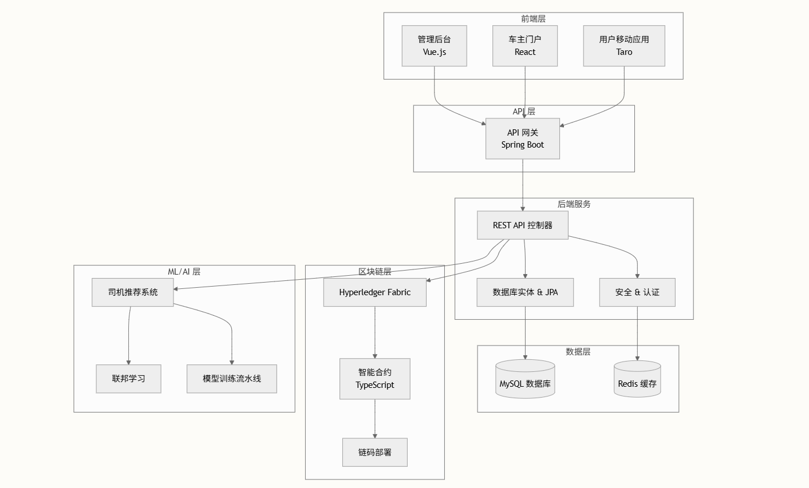

# 🚀 Blockchain_NEV

[![zread](https://img.shields.io/badge/Ask_Zread-_.svg?style=flat&color=00b0aa&labelColor=000000&logo=data%3Aimage%2Fsvg%2Bxml%3Bbase64%2CPHN2ZyB3aWR0aD0iMTYiIGhlaWdodD0iMTYiIHZpZXdCb3g9IjAgMCAxNiAxNiIgZmlsbD0ibm9uZSIgeG1sbnM9Imh0dHA6Ly93d3cudzMub3JnLzIwMDAvc3ZnIj4KPHBhdGggZD0iTTQuOTYxNTYgMS42MDAxSDIuMjQxNTZDMS44ODgxIDEuNjAwMSAxLjYwMTU2IDEuODg2NjQgMS42MDE1NiAyLjI0MDFWNC45NjAxQzEuNjAxNTYgNS4zMTM1NiAxLjg4ODEgNS42MDAxIDIuMjQxNTYgNS42MDAxSDQuOTYxNTZDNS4zMTUwMiA1LjYwMDEgNS42MDE1NiA1LjMxMzU2IDUuNjAxNTYgNC45NjAxVjIuMjQwMUM1LjYwMTU2IDEuODg2NjQgNS4zMTUwMiAxLjYwMDEgNC45NjE1NiAxLjYwMDFaIiBmaWxsPSIjZmZmIi8%2BCjxwYXRoIGQ9Ik00Ljk2MTU2IDEwLjM5OTlIMi4yNDE1NkMxLjg4ODEgMTAuMzk5OSAxLjYwMTU2IDEwLjY4NjQgMS42MDE1NiAxMS4wMzk5VjEzLjc1OTlDMS42MDE1NiAxNC4xMTM0IDEuODg4MSAxNC4zOTk5IDIuMjQxNTYgMTQuMzk5OUg0Ljk2MTU2QzUuMzE1MDIgMTQuMzk5OSA1LjYwMTU2IDE0LjExMzQgNS42MDE1NiAxMy43NTk5VjExLjAzOTlDNS42MDE1NiAxMC42ODY0IDUuMzE1MDIgMTAuMzk5OSA0Ljk2MTU2IDEwLjM5OTlaIiBmaWxsPSIjZmZmIi8%2BCjxwYXRoIGQ9Ik0xMy43NTg0IDEuNjAwMUgxMS4wMzg0QzEwLjY4NSAxLjYwMDEgMTAuMzk4NCAxLjg4NjY0IDEwLjM5ODQgMi4yNDAxVjQuOTYwMUMxMC4zOTg0IDUuMzEzNTYgMTAuNjg1IDUuNjAwMSAxMS4wMzg0IDUuNjAwMUgxMy43NTg0QzE0LjExMTkgNS42MDAxIDE0LjM5ODQgNS4zMTM1NiAxNC4zOTg0IDQuOTYwMVYyLjI0MDFDMTQuMzk4NCAxLjg4NjY0IDE0LjExMTkgMS42MDAxIDEzLjc1ODQgMS42MDAxWiIgZmlsbD0iI2ZmZiIvPgo8cGF0aCBkPSJNNCAxMkwxMiA0TDQgMTJaIiBmaWxsPSIjZmZmIi8%2BCjxwYXRoIGQ9Ik00IDEyTDEyIDQiIHN0cm9rZT0iI2ZmZiIgc3Ryb2tlLXdpZHRoPSIxLjUiIHN0cm9rZS1saW5lY2FwPSJyb3VuZCIvPgo8L3N2Zz4K&logoColor=ffffff)](https://zread.ai/SoftGhostGU/Blockchain_NEV) [](https://deepwiki.com/SoftGhostGU/Blockchain_NEV)

📖 英文版本：[英语版 README](README.en.md)

### 概述

🚏 Blockchain_NEV 是一个综合性的去中心化网约车平台，集成了**区块链技术**、**联邦学习**和**多平台前端**应用，致力于打造安全、智能且用户友好的交通生态系统。该项目展示了现代网络技术与分布式账本技术的融合，旨在为共享出行服务建立信任和透明度。

✨ 项目使用 `pnpm workspaces` 进行 `monorepo` 管理，实现高效的依赖处理和所有前端应用的一致构建流程 [pnpm-workspace.yaml#L1]。

### 系统架构

🎉 该平台采用**微服务架构**，在各层级间实现了清晰的职责分离：





#### 前端应用

平台提供**三种不同的前端应用**，针对不同用户角色量身定制：

| 应用       | 技术栈                 | 目标平台       | 核心功能                     |
|------------|------------------------|--------------|----------------------------|
| 🔁 管理控制台 | Vue.js + Naive UI      | Web          | 行政管理、系统监控           |
| 🚗 车主门户   | React + Ant Design     | Web          | 车队管理、收入分析           |
| 📱 用户移动应用 | Taro + React           | H5/微信/支付宝 | 叫车服务、实时追踪           |

所有应用通过集中的 `api/` 包共享**通用 API 工具**和**地图服务**，确保数据处理的一致性，并集成**Amap（高德地图）**服务实现定位功能 [packages/owner/package.json#L31]。

#### 后端服务

🧠 **Spring Boot 后端** 作为中央 API 网关，提供全面功能：

- **RESTful API 控制器** 处理 HTTP 请求和业务逻辑
- **JPA 数据库集成** 使用 MySQL 进行持久化数据存储
- **安全层** 实现 JWT 认证和 Spring Security
- **Redis 缓存** 用于性能优化和会话管理
- **Hyperledger Fabric 网关** 集成以进行区块链交互

后端配置使用 **Java 17**，包含区块链集成、验证和监控的相关依赖 [backend/pom.xml#L13]。

#### 区块链集成

⛓️ 区块链层利用 Hyperledger Fabric 进行去中心化交易处理：

- **智能合约** 使用 TypeScript 编写，实现业务逻辑
- **链码部署** 脚本用于网络设置和初始化
- **金融交易**、**模型数据** 和 **订单管理** 链码

三个主要链码包处理平台的不同方面：

- `blockchain-financials/` - 金融交易和支付
- `blockchain-model/` - ML 模型数据完整性和版本控制
- `blockchain-orders/` - 订单生命周期和争议解决

#### 联邦学习模型

🧠 **AI/ML 服务** 提供智能司机推荐：

- **司机推荐系统** 使用协同过滤和 ML 算法
- **联邦学习** 用于保护隐私的模型训练
- **基于 FastAPI 的服务** 提供预测接口 [model/main.py#L57]

核心 ML 接口包括：

- `POST /predict_top5` - 前 5 名司机推荐 🎯
- `POST /complete_order` - 订单完成并更新模型 ✅
- `GET /train_loss_plot` - 训练性能可视化 📊

### 技术栈

| 层级     | 技术栈                                               | 用途                     |
|----------|------------------------------------------------------|--------------------------|
| 🧱 前端      | Vue.js, React, Taro, TypeScript                      | 多平台 UI 开发           |
| 🖥️ 后端      | Spring Boot, Java 17, MySQL, Redis                    | API 服务和数据管理       |
| 🛠️ 区块链    | Hyperledger Fabric, TypeScript, Docker               | 分布式账本和智能合约     |
| 🤖 AI/ML     | Python, FastAPI, PyTorch, Federated Learning         | 司机推荐和分析           |
| 💻 DevOps    | Docker, Maven, pnpm, Redis                           | 构建自动化和部署         |

### 项目结构

```text
Blockchain_NEV/
├── packages/           
│   ├── admin/         # Vue.js 管理控制台
│   ├── owner/         # React 车主门户
│   └── user/          # Taro 移动应用
├── backend/           # Spring Boot API 服务
├── blockchain/        # Hyperledger Fabric 链码
├── model/             # ML/AI 服务
├── api/               # 共享 API 工具
└── Redis-x64-3.0.504/ # 缓存层
```

### 快速开始

1. 💾 安装依赖

首先安装根目录依赖和所有工作区包：

```bash
# 安装根目录依赖
pnpm install
 
# 安装所有工作区包
pnpm install --recursive
```
2. 🗃️ 设置数据库

配置 MySQL 数据库并导入初始数据：

```bash
# 创建数据库
mysql -u root -p
CREATE DATABASE blockchain_nev;
 
# 导入模拟数据（位于 /model/data/）
mysql -u root -p blockchain_nev < model/data/mock_data.sql
```

3. 🔐 启动 Redis

Windows 用户可使用项目内置的 Redis：

```bash
# 启动 Redis 服务器
cd Redis-x64-3.0.504
redis-server.exe redis.windows.conf
```

4. 🏠 启动后端服务

启动 Spring Boot 后端：

```bash
cd backend
mvn clean package -DskipTests
java -jar target/backend-0.0.1-SNAPSHOT.jar
```

后端 API 将在 http://localhost:8080 可用

5. 🌐 部署区块链网络

部署 Hyperledger Fabric 网络：

```bash
cd blockchain/fabric-example
 
# 下载 Fabric 二进制文件和 Docker 镜像
./install-fabric.sh d b
 
cd test-network
 
# 启动网络并创建通道
./network.sh up createChannel -c mychannel
 
# 部署链码
./network.sh deployCC -ccn basic -ccp ../asset-transfer-basic/chaincodes/chaincode-typescript/ -ccl typescript
```

6. 🧠 启动联邦学习服务

启动联邦学习推荐服务：

```bash
cd model
pip install -r requirements.txt
python server.py
```

联邦学习服务将在 http://localhost:8000 可用

7. 🏗️ 运行前端应用

根据需求选择运行相应前端：

管理后台 (Vue.js)

```bash
pnpm dev:admin
# 访问地址 http://localhost:5173
```

车主门户 (React)

```bash
pnpm dev:owner
# 访问地址 http://localhost:5174
```

用户移动应用 (Taro)

```bash
# H5 开发模式
pnpm dev:user:h5
# 访问地址 http://localhost:5175
 
# 微信小程序模式
pnpm dev:user:weapp
```

8. 🔬 其他命令参考 [package.json]
